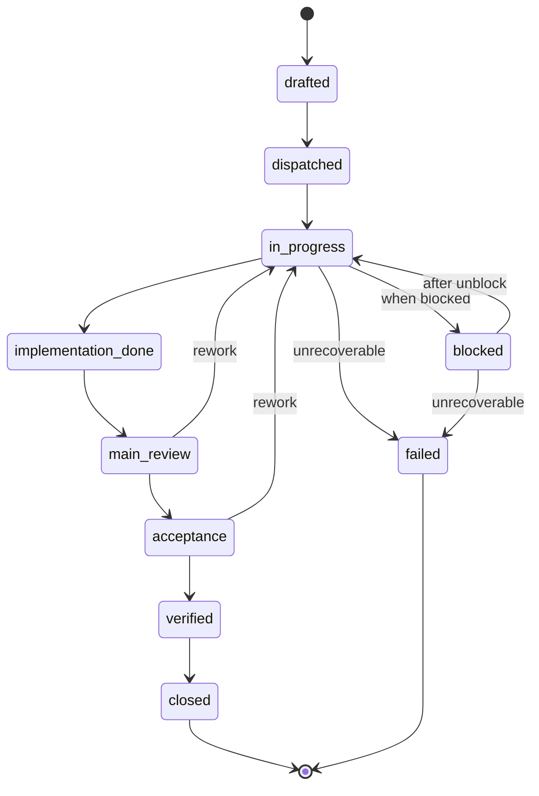

# SoT 任务流程

所有工作通过两条路径进入系统：

## Path A: Bug → Issue → Task
```
发现问题 → 创建 Issue → Main triage → 创建 Task (关联 Issue) → 派发
```
触发条件：bug、crash、行为不符合预期。

## Path B: 计划功能 → Task
```
Main 创建 Task → 派发
```
触发条件：计划新增功能。

**Issue 和 Task 是独立实体**：Issue 记录"发生了什么"，Task 记录"要做什么"。

## Task 状态机

> 代码实现: `packages/orchestrator/src/task-manager.ts` — `VALID_TRANSITIONS` 常量



**转换说明**:

| 转换 | 触发方式 | 说明 |
|------|----------|------|
| `drafted → dispatched` | Main 派发 | 创建分支，发送 dispatch prompt |
| `dispatched → in_progress` | 系统自动 | Dev agent 开始执行 |
| `in_progress → implementation_done` | Dev 提交 receipt | Dev 填写 implementationReceipt |
| `implementation_done → main_review` | 系统自动 | 进入 Main 审核队列 |
| `main_review → acceptance` | Main 人工审核 | Receipt 完整性检查通过 |
| `main_review → in_progress` | Main 人工审核 | Rework: receipt 不完整或实现有误 |
| `acceptance → verified` | Acceptance 盲审 | Verdict: pass |
| `acceptance → in_progress` | Acceptance 盲审 | Rework: verdict fail/partial |
| `verified → closed` | Main 关闭 | 合并 PR，归档 |
| `in_progress → blocked` | Dev/Main 标记 | 外部依赖阻塞 |
| `blocked → in_progress` | Main 解除阻塞 | 阻塞条件消除 |
| `in_progress/blocked → failed` | Main 标记 | 不可恢复的失败（终态） |

## Task 执行流程

| 步骤 | 角色 | 操作 | 输出 |
|------|------|------|------|
| 1. Create | Main | 创建 TaskBundle，保存到 KB | `10-tasks/TASK-{phase}-{nnn}.json` |
| 2. Dispatch | Main | 创建 feature branch，派发给 dev | agent session |
| 3. Implement | Dev | 在 scope 内实现，填写 receipt | 更新 TaskBundle |
| 4. Main Review | Main | Receipt 完整性检查 | 更新 mainReview |
| 5. Acceptance | Acceptance | 盲审，输出 verdict | `12-acceptances/ACC-{phase}-{nnn}.json` |
| 6. Close/Rework | Main | 关闭 task 或触发 rework | 更新 task + issue 状态 |

## Issue 登记

| 步骤 | 角色 | 操作 |
|------|------|------|
| 0a. Report | 任意角色 | 填写 Issue（模板: `issue-bundle.template.json`） |
| 0b. Triage | Main | 评估优先级，关联 Task |

## Session Handoff

TaskBundle + git 分支状态是天然的 handoff 机制：

| 信息 | 来源 | 说明 |
|------|------|------|
| 任务上下文 | `TaskBundle.context` | 完整任务描述 |
| 实施进度 | `TaskBundle.implementationReceipt` | 已完成工作 |
| 代码状态 | `git log <branch>` | 分支上的所有 commit |
| 未完成项 | `TaskBundle.definitionOfDone` vs receipt | 对比可知剩余 |
| 历史 rework | `TaskBundle.reworkHistory` | 之前的尝试和反馈 |

**Handoff JSON 降级为可选归档**：仅在跨 session 需要额外人工备注时手动创建。
日常任务流转不再需要独立的 handoff 文件。

## 补充模板

| 模板 | 位置 | 用途 |
|------|------|------|
| `handoff-packet.template.json` | `{Project}_KB/99-templates/` | Session 转交（可选归档） |
| `session-context.template.json` | `{Project}_KB/99-templates/` | Milestone 快照 |
| `dispatch-prompt.template.md` | `.mercury/templates/` | Dev dispatch prompt（运行时填充） |
| `acceptance-prompt.template.md` | `.mercury/templates/` | Acceptance dispatch prompt（运行时填充） |

KB 模板位置: `{Project}_KB/99-templates/`
代码模板位置: `.mercury/templates/`
